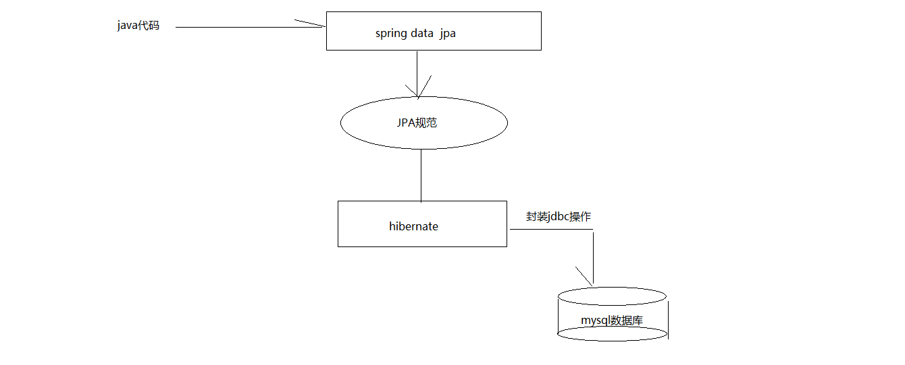
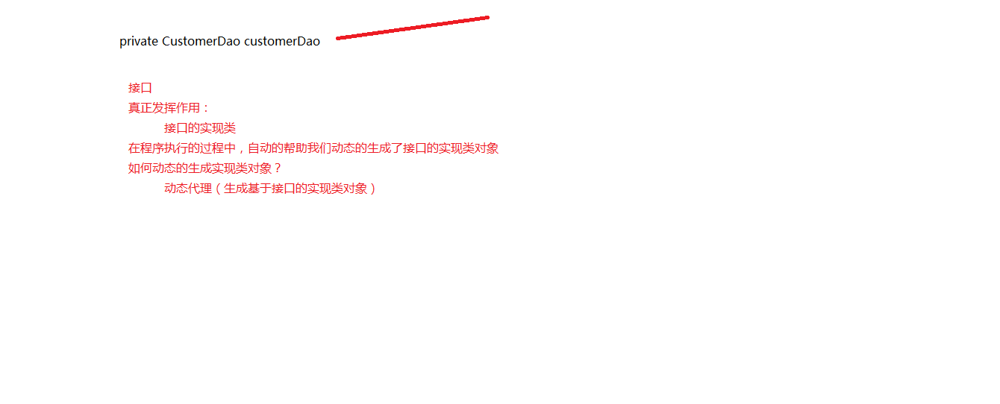
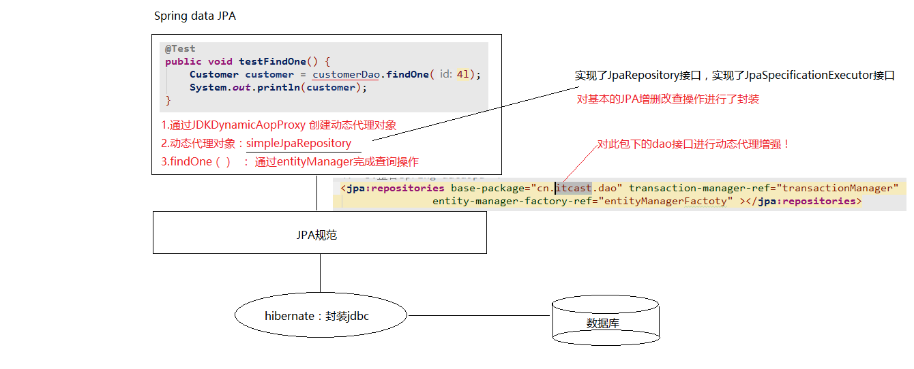

SpringDataJpa的入门操作
=======
### 案例:客户的基本CRUD操作
#### i.搭建环境
* 创建工程导入坐标  
* 配置spring的配置文件（配置sping Data jpa的整合）  
* 编写实体类(Customer),使用jpa注解配置映射关系  
#### ii.编写一个符合springDataJpa的dao层接口 
* 只需要编写dao层接口，不需要编写dao层接口的实现类  
* dao层接口规范  
  1 .需要继承两个接口(JpaRepository,JpaSpecificationExecutor)  
  2 .需要提供相应的泛型    

> findOne(id):根据id查询  
> save(customer):保存或者更新（依据：传递的实体类对象中是否含id属性）  
> delete(id):根据id删除  
> findAll():查询全部  

#### iii.springDataJpa的运行过程和原理剖析  
1. 通过JdkDynamicAopProxy的invoke方法创建一个动态代理对象  
2. SimpleJpaRepository当中封装了JPA的操作(借助JPA的api完成数据库的CRUD)  
3. 通过hibernate完成数据库操作（封装了jdbc）  

#### IV.复杂查询
* 1. 借助接口中的定义好的方法完成查询  
    + findOne(id):根据id查询  
* 2. jpql的查询方式  
    + jpql:jpa query language(jpq查询语言)  
    + 特点:语法和关键字和sql语句类似  
    + 查询的是类和类中的属性  
    
    + 需要将JPQL语句配置到接口方法上  
        * 特有的查询，需要在dao接口上配置方法  
        * 在新添加的方法上，使用注解的形式配置jpql查询语句  
        * 注解：@Query  
* 3. sql语句的查询  
    + 特有的查询：需要在dao接口上配置方法  
    + 在新添加的方法上，使用注解的形式配置sql查询语句  
    + 注解：@Query  
        value:jpql语句 | sql语句  
        nativeQuery: false(使用jpql查询) | true(使用本地查询：sql查询)  
        是否使用本地查询  
* 4. 方法名称规则查询  
    + 是对jpql查询，更新深入的一层封装  
    + 我们只需要按照SpringDataJpa提供发方法名称规则定义方法，不需要再去配置jpql语句，完成查询  
    
    findBy开头：代表查询  
    对象中属性的名称（首字母大写）
    含义：根据属性名称进行查询  
### 图解
#### 1.springDataJpa，jpa，hibernate关系图解
  

#### 2.动态分析图解
  

#### 3.springdatajpa的运行过程
  